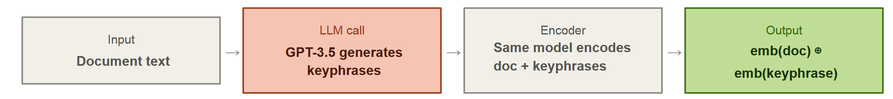
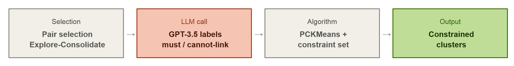
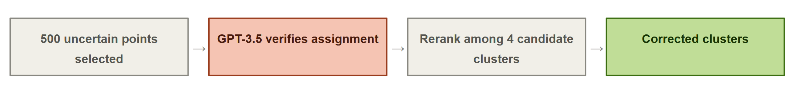
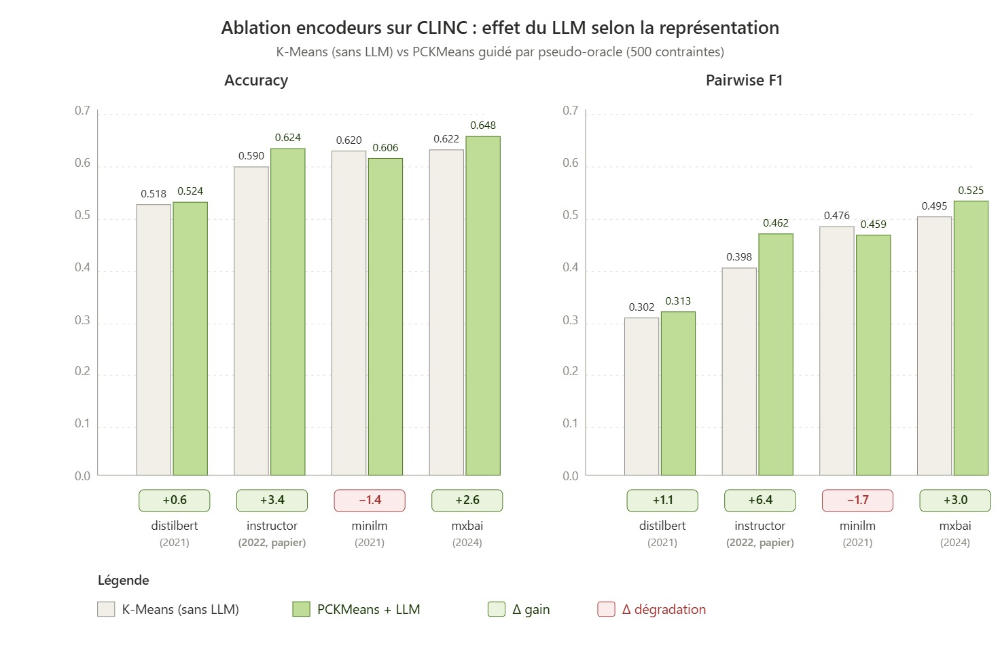
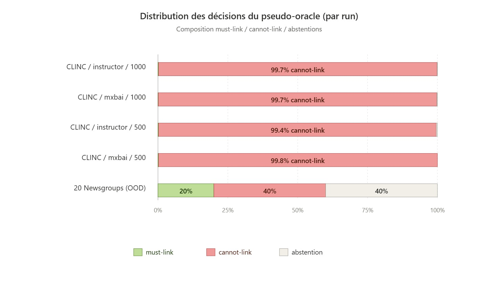
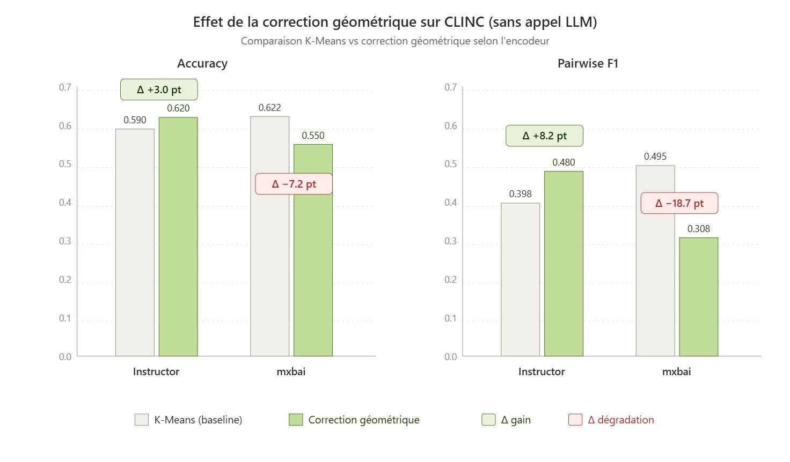
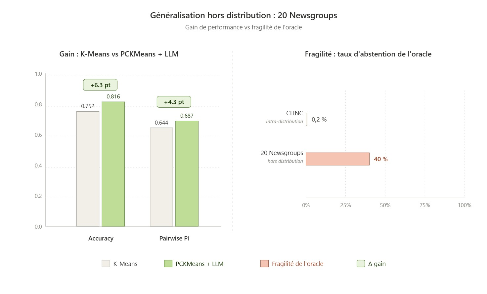

# LLM as a Clustering Oracle: Necessary at Every Stage?

> Analyse critique et reproduction partielle de **Viswanathan et al. (2024)** *Large Language Models Enable Few-Shot Clustering* (TACL).
> Projet tutoré M1 - Master Machine Learning pour la Science des Données, Université Paris Cité, 2025/2026.

[](LICENSE)
[](https://www.python.org/)
[](https://doi.org/10.1162/tacl_a_00648)
[](https://arxiv.org/abs/2307.00524)
[]()

<p align="center">
  
  
  
</p>

---

## Question de recherche

> *Le pseudo-oracle LLM dans le clustering de texte : apport sémantique réel ou compensation technique substituable ?*

L'article étudié propose d'injecter un LLM (GPT-3.5) à **trois stades** d'un pipeline de clustering pour remplacer l'annotateur humain. Nous avons conçu une évaluation par stade, afin d'isoler ce qui est effectivement dû au LLM de ce qui pourrait être attribué à d'autres facteurs (encodeur, géométrie de l'espace, échantillonnage des contraintes).

---

## Le pipeline en trois stades

| Stade                        | Rôle du LLM | Coût rapporté |
|------------------------------|---|---|
| **Avant** : *enrichissement* | Génère des keyphrases qui enrichissent l'embedding des documents | $1–10 / dataset |
| **Pendant** : *contraintes*  | Joue le rôle de pseudo-oracle pairwise dans PCKMeans (must-link / cannot-link) | $10–42 / dataset |
| **Après** : *correction*     | Réévalue les points à faible confiance et les réassigne éventuellement | $3–13 / dataset |

---

## Nos quatre évaluations complémentaires

Chaque évaluation cible une revendication précise de l'article et la confronte à une contre-hypothèse vérifiable.

| Évaluation | Stade visé | Question posée | Verdict                                                                           |
|---|---|---|-----------------------------------------------------------------------------------|
| **1. Ablation encodeurs** | Avant | Le gain vient-il du LLM ou d'un encodeur daté (Instructor 2022) ? | Encodeur moderne sans LLM (mxbai 2024) **égale** Instructor + LLM                 |
| **2. Cohérence transitive** | Pendant | Les 20 000 contraintes pairwise sont-elles logiquement cohérentes ? | Zéro contradiction… mais 99,7 % de cannot-link → signal **trivialement** cohérent |
| **3. Baseline géométrique** | Après | Une simple règle géométrique sans LLM suffit-elle ? | Sur l'encodeur du papier : **oui** (et même mieux, à coût zéro)                   |
| **4. Généralisation OOD** | Transversal | Les conclusions tiennent-elles hors distribution (20 Newsgroups) ? | Signal présent (+6,3 acc) mais **40 % d'abstentions** de l'oracle                 |

### Évaluation 1 : Ablation encodeurs

<p align="center">
  
</p>

L'article utilise Instructor (Su et al., 2022) comme encodeur de base sur Bank77 et CLINC. Depuis, plusieurs encodeurs entraînés par apprentissage contrastif ont été publiés.  mxbai-embed-large-v1 (Lee et al., 2024) en est un représentant : 334 M paramètres, parmi les meilleurs scores du benchmark MTEB. Nous cherchons à savoir si le gain attribué aux keyphrases se maintient quel que soit l'encodeur ou s'il s'explique en partie par le caractère désormais daté d'Instructor.


Nous avons reproduit le pipeline PCKMeans pseudo-oracle sur CLINC en substituant Instructor par trois encodeurs alternatifs : DistilBERT-NLI (borne inférieure), MiniLM-L6-v2 (2021) et mxbai-embed-large-v1 (2024), à pipeline et seeds identiques. K-means sur mxbai seul (accuracy 0,622) atteint un score quasiment identique à Instructor + LLM (0,624), soit +3,2 points gagnés sans aucun appel API par simple mise à jour de l'encodeur. L'ajout du LLM sur mxbai porte ensuite le score à 0,648, soit un gain de +2,6 points : un effet réel mais d'un ordre de grandeur comparable à celui obtenu gratuitement par le changement d'encodeur. Sur MiniLM, l'ajout du LLM dégrade légèrement la performance (−1,4). L'apport du LLM dépend donc de l'encodeur. L'apport du LLM apparaît donc conditionné par l'encodeur et compense en grande partie l'écart à un encodeur récent plutôt qu'il n'ajoute un signal sémantique irremplaçable. 
### Évaluation 2 : Cohérence logique des contraintes

<p align="center">
  
</p>
 PCKMeans pénalise les violations de contraintes dans sa fonction objectif sans les imposer en dur. Si l'oracle produit ML(A,B), ML(B,C) mais CL(A,C), l'algorithme intègre l'incohérence sans la signaler. L'article ne mesure jamais la cohérence transitive des 20 000 décisions générées, alors qu'il s'agit d'un indicateur direct de la qualité du signal injecté.

Nous avons enregistré l'intégralité des décisions du pseudo-oracle, reconstruit le graphe de contraintes et compté les violations transitives sur l'ensemble des triades complètes. Sur CLINC, aucune contradiction n'est observée. Mais 99,7 % des décisions sont des cannot-link et un graphe composé presque exclusivement de cannot-link ne peut, par construction, contenir de violation transitive. L'absence de contradiction ne renseigne donc pas sur la qualité du signal: elle traduit surtout le fait que le LLM confirme ce que la géométrie de l'espace d'embedding indique déjà. 
### Évaluation 3 : Baseline géométrique pour la post-correction

<p align="center">
  
</p>

La post-correction proposée par les auteurs interroge un LLM sur l'appartenance des points à faible marge à quatre clusters voisins. L'article ne rapporte aucune comparaison à une baseline non-LLM, ce qui empêche de savoir si l'amélioration provient du jugement sémantique du modèle ou simplement du fait de réexaminer les points incertains.

Nous avons construit une baseline analogue à la post-correction LLM (identification des points à faible marge, représentation des clusters candidats par prototypes) en remplaçant le jugement du modèle par une règle géométrique : pour chaque point incertain, nous comparons sa similarité cosinus moyenne aux trois plus proches voisins du centroïde de chaque cluster candidat à celle de son cluster actuel et nous le réassignons au candidat offrant le meilleur gain dès lors que celui-ci dépasse un certain seuil. Sur l'encodeur du papier (Instructor), cette baseline apporte +3,0 points d'accuracy et +8,2 en pairwise F1 sans aucun appel API, soit des gains comparables à ceux rapportés par l'article pour la post-correction LLM (+0,1 à +5,2 points selon les datasets). Sur un encodeur plus performant (mxbai), la même règle dégrade fortement la performance (−7,2 en accuracy, −18,7 en pairwise F1). Dans l'espace d'embedding produit par mxbai, les distances entre clusters ne reflètent pas toujours la proximité sémantique réelle, ainsi une règle de réassignation fondée uniquement sur la similarité cosinus produit alors des reclassements erronés.

### Évaluation 4 : Généralisation hors distribution

<p align="center">
  
</p>

 Les cinq datasets utilisés par l'article partagent plusieurs caractéristiques restrictives : textes courts (5 à 20 mots), exclusivement en anglais, orientés dialogue ou mentions d'entités. Aucun n'aborde le clustering thématique de documents plus longs pourtant fréquent en pratique. 

Nous avons exécuté le pipeline pseudo-oracle sur 20 Newsgroups (variante diff3, trois catégories sémantiquement voisines) avec un encodage TF-IDF et 30 contraintes générées. Le LLM apporte un gain réel (+6,3 points d'accuracy) mais il s'abstient sur 40 % des décisions (contre moins de 1 % sur CLINC). L'audit de cohérence détecte une contradiction transitive parmi les triangles formés (taux de 25 %). Le mécanisme se transpose donc à un nouveau domaine mais avec une fiabilité moindre dès lors que les textes deviennent plus longs et le vocabulaire plus varié que dans les datasets de calibration.

## Résultat principal en une phrase

**Le découpage en trois stades reste un cadre pertinent pour analyser le pipeline mais les gains rapportés sont contingents à l'encodeur utilisé, à la distribution des contraintes générées et à la qualité initiale du clustering.** Sur un encodeur moderne, le LLM peut même *dégrader* la performance.

> Détails et chiffres dans le [rapport complet](deliverables/rapport.pdf).

---

## Livrables

Trois documents, chacun destiné à un usage distinct.

| Document | Format       | Public                         | Lien |
|---|--------------|--------------------------------|---|
| Rapport (FR) | PDF, 20 pages | Lecture approfondie            | [`deliverables/rapport.pdf`](deliverables/rapport.pdf) |
| Slides de soutenance (EN) | PDF, 27 slides | Présentation orale    | [`deliverables/slides.pdf`](deliverables/slides.pdf) |
| Poster (EN) | PDF          | Vue synthétique  | [`deliverables/poster.pdf`](deliverables/poster.pdf) |

---

## Code source

Le code complet (reproduction du papier + implémentation des 4 évaluations + tests + pipeline d'orchestration) est maintenu dans le dépôt collaboratif du groupe :

➡️ **[github.com/Dr2xU/few-shot-clustering](https://github.com/Dr2xU/few-shot-clustering)**

Ce dépôt contient :
- une couche de reproductibilité ajoutée au-dessus du code original (`few_shot_clustering/env_config.py`, `oracles.py`, `telemetry.py`) ;
- les scripts d'évaluation pour chacune de nos 4 expériences (`scripts/evals/`) ;
- les workflows PowerShell d'orchestration de bout en bout (`scripts/workflows/`) ;
- 31 tests automatisés (`tests/`) ;
- une documentation reproductibilité dédiée (`REPRODUCIBILITY.md`).

---

## Citation

Si vous utilisez ce travail (analyse critique ou évaluations complémentaires) merci de citer :

```bibtex
@misc{zghrata2026llm_clustering_oracle,
  title  = {{LLM as a Clustering Oracle: Necessary at Every Stage?}},
  author = {Zghrata, Wissal and Zeidan, Rim and Akil, Wa{\"e}l},
  year   = {2026},
  note   = {Tutored project, M1 ML for Data Science, Universit{\'e} Paris Cit{\'e}},
  howpublished = {\url{https://github.com/wixii/llm-clustering-oracle-analysis}}
}
```

Et l'article original :

```bibtex
@article{viswanathan2024fewshot,
  title   = {Large Language Models Enable Few-Shot Clustering},
  author  = {Viswanathan, Vijay and Gashteovski, Kiril and Lawrence, Carolin and Wu, Tongshuang and Neubig, Graham},
  journal = {Transactions of the Association for Computational Linguistics},
  volume  = {12},
  pages   = {321--333},
  year    = {2024},
  doi     = {10.1162/tacl_a_00648}
}
```

---

## Licence

Code et livrables publiés sous [licence MIT](LICENSE),  conformément à la licence du dépôt original de Viswanathan et al.
